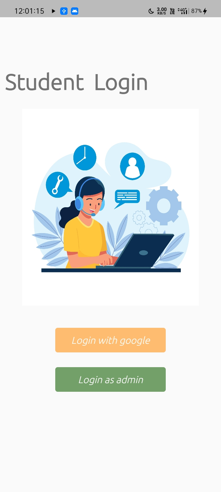
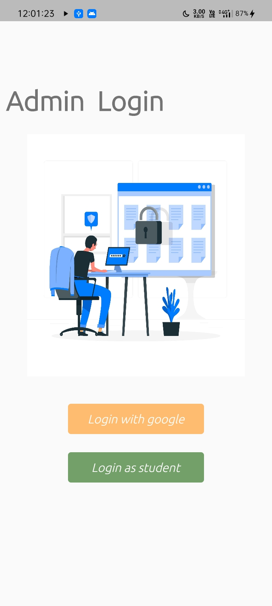
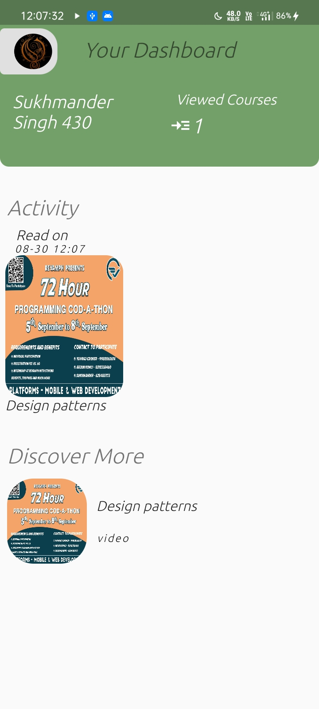

# aptcoder

A new Flutter project.

## Screenshots

## Introduction
The app is made with flutter by using the clean architecture to achieve maximum separation of concerns.

## Features
* Admin and student login for different users
* Admins can and new courses
* Students can view courses added by admin as files
* Student can preview their history(Last Viewed courses)
* Student can edit their profile

## Getting Started

Demo Project